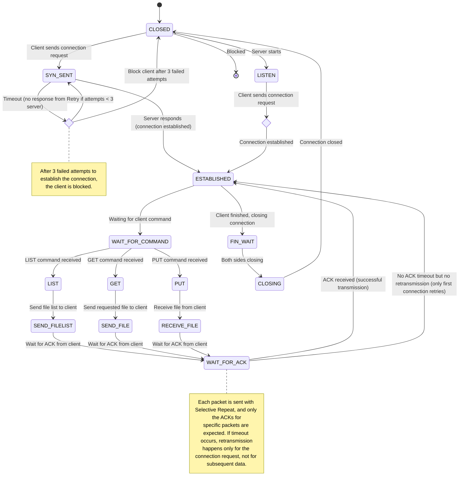

# State Machine

```mermaid
stateDiagram-v2
    [*] --> CLOSED

    state retry_logic <<choice>>
    state server_connection <<choice>>
    
    CLOSED --> LISTEN: Server starts
    CLOSED --> SYN_SENT: Client sends connection request
    CLOSED --> [*]: Blocked

    SYN_SENT --> retry_logic: Timeout (no response from server)
    retry_logic --> SYN_SENT: Retry if attempts < 3
    retry_logic --> CLOSED: Block client after 3 failed attempts
    
    SYN_SENT --> ESTABLISHED: Server responds (connection established)
    LISTEN --> server_connection: Client sends connection request
    server_connection --> ESTABLISHED: Connection established
    
    ESTABLISHED --> WAIT_FOR_COMMAND: Waiting for client command
    WAIT_FOR_COMMAND --> LIST: LIST command received
    WAIT_FOR_COMMAND --> GET: GET command received
    WAIT_FOR_COMMAND --> PUT: PUT command received

    LIST --> SEND_FILELIST: Send file list to client
    GET --> SEND_FILE: Send requested file to client
    PUT --> RECEIVE_FILE: Receive file from client

    SEND_FILELIST --> WAIT_FOR_ACK: Wait for ACK from client
    SEND_FILE --> WAIT_FOR_ACK: Wait for ACK from client
    RECEIVE_FILE --> WAIT_FOR_ACK: Wait for ACK from client

    WAIT_FOR_ACK --> ESTABLISHED: ACK received (successful transmission)
    WAIT_FOR_ACK --> ESTABLISHED: No ACK timeout but no retransmission (only first connection retries)

    ESTABLISHED --> FIN_WAIT: Client finished, closing connection
    FIN_WAIT --> CLOSING: Both sides closing
    CLOSING --> CLOSED: Connection closed

    note right of retry_logic
        After 3 failed attempts to establish the connection,
        the client is blocked.
    end note

    note right of WAIT_FOR_ACK
        Each packet is sent with Selective Repeat, and only the ACKs for
        specific packets are expected. If timeout occurs, retransmission
        happens only for the connection request, not for subsequent data.
    end note
```